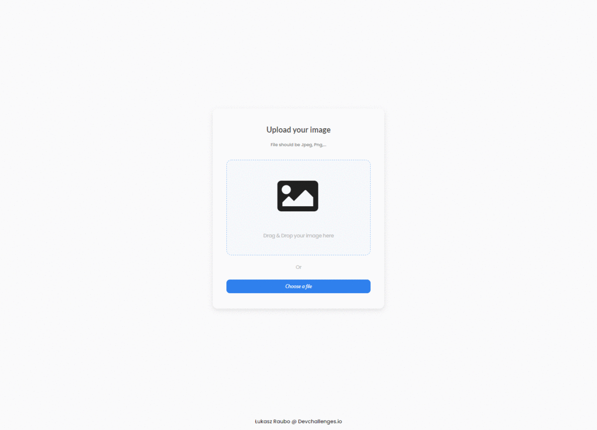

<h1 align="center">Image Uploader</h1>

<div align="center">
   Solution for a challenge from  <a href="http://devchallenges.io" target="_blank">Devchallenges.io</a>.
</div>

<div align="center">
  <h3>
    <!-- <a href="https://{your-demo-link.your-domain}">
      Demo
    </a>
    <span> | </span> -->
    <a href="https://github.com/RauboLuk/Image-Uploader-devchallenges.io">
      Solution
    </a>
    <span> | </span>
    <a href="https://devchallenges.io/challenges/O2iGT9yBd6xZBrOcVirx">
      Challenge
    </a>
  </h3>
</div>

<!-- TABLE OF CONTENTS -->

## Table of Contents

- [Overview](#overview)
  - [Built With](#built-with)
- [Features](#features)
- [How to use](#how-to-use)
- [Contact](#contact)
- [Acknowledgements](#acknowledgements)

<!-- OVERVIEW -->

## Overview


ETC: ~19h

### Built With

- [Create React App](https://create-react-app.dev/)
- [Express](https://expressjs.com/)
- [mongoose](https://mongoosejs.com/)
- [React](https://reactjs.org/)
- [Styled Components](https://styled-components.com/)
<!-- - [cors](https://www.npmjs.com/package/cors) -->
<!-- - [dotenv](https://www.npmjs.com/package/dotenv) -->
<!-- - [express-fileupload](https://www.npmjs.com/package/express-fileupload) -->
<!-- - [MongoDB](https://www.mongodb.com/) -->
<!-- - [Semantic UI React](https://react.semantic-ui.com/) -->

## Features

This application/site was created as a submission to a [DevChallenges](https://devchallenges.io/challenges) challenge. The [challenge](https://devchallenges.io/challenges/O2iGT9yBd6xZBrOcVirx) was to build an application to complete the given user stories:

- [x] User story: I can drag and drop an image to upload it
- [x] User story: I can choose to select an image from my folder
- [x] User story: I can see a loader when uploading
- [x] User story: When the image is uploaded, I can see the image and copy it
- [x] User story: I can choose to copy to the clipboard

## How To Use

To clone and run this application, you'll need [Git](https://git-scm.com) and [Node.js](https://nodejs.org/en/download/) (which comes with [npm](http://npmjs.com)) installed on your computer. From your command line:

Create `.env.local` file based on `.env.local.example`
```bash
# Clone this repository
$ git clone https://github.com/RauboLuk/Image-Uploader-devchallenges.io.git

# Install dependencies
$ npm install

# Build the app
$ npm run build

# Run the app
$ npm run start-prod
```

## Acknowledgements

- [Delete MongoDB document at specific time](https://stackoverflow.com/questions/38472125/delete-mongodb-document-at-specific-time)
- [event.dataTransfer.files is empty when ondrop is fired?](https://stackoverflow.com/questions/11573710/event-datatransfer-files-is-empty-when-ondrop-is-fired)
- [How to upload files in Node.js and Express](https://attacomsian.com/blog/uploading-files-nodejs-express)
- [HTML5 drop event doesn't work unless dragover is handled](https://stackoverflow.com/questions/8414154/html5-drop-event-doesnt-work-unless-dragover-is-handled)
- [infinite loading bar (css only)](https://codepen.io/snak3/pen/QOOqGW)
- [Upload and Retrieve Image on MongoDB using Mongoose](https://www.geeksforgeeks.org/upload-and-retrieve-image-on-mongodb-using-mongoose/)
- [Serving Apps with Client-Side Routing](https://create-react-app.dev/docs/deployment/#serving-apps-with-client-side-routing)
- [Store images in a MongoDB database](https://stackoverflow.com/questions/4796914/store-images-in-a-mongodb-database)
<!-- https://stackoverflow.com/a/44467274 -->

## Contact

- GitHub [@RauboLuk](https://github.com/RauboLuk)
- Stack Overflow [@RauboLuk](https://stackoverflow.com/users/9185799/rauboluk)
